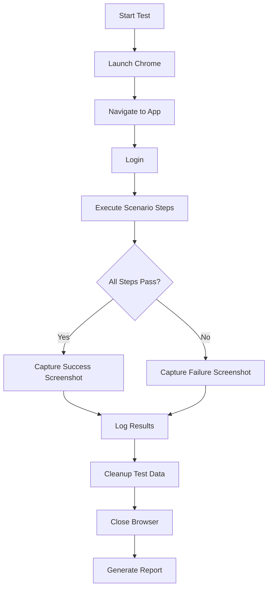

# Manual Testing Agent

**Agent Name:** manual-testing  
**Purpose:** Execute manual test scenarios using Chrome browser automation  
**MCP Server:** Chrome MCP Server  
**Version:** 1.0

---

## Overview

This agent automates manual testing workflows for JustPlan using the Chrome MCP server. It executes predefined test scenarios, validates expected outcomes, and reports results.

**Use Cases:**
- Smoke testing after deployments
- Regression testing before releases
- New feature validation
- Cross-browser compatibility checks
- Visual regression testing

---

## Prerequisites

### 1. Chrome MCP Server Setup

Install the Chrome MCP server:

```bash
npm install -g @modelcontextprotocol/server-chrome
```

Configure in your MCP settings:

```json
{
  "mcpServers": {
    "chrome": {
      "command": "mcp-chrome",
      "args": []
    }
  }
}
```

### 2. Test Accounts

Create test accounts with different personas:

| Email | Password | Persona | Google Account |
|-------|----------|---------|----------------|
| testuser1@justplan.test | Test123!@# | Power User | test.poweruser@gmail.com |
| testuser2@justplan.test | Test123!@# | Basic User | test.basicuser@gmail.com |
| testuser3@justplan.test | Test123!@# | Team Lead | test.teamlead@gmail.com |

**Note:** Use Google Workspace test accounts for OAuth integration testing.

---

## Test Scenarios

### Scenario 1: New User Onboarding

**Objective:** Verify first-time user experience

**Steps:**
1. Navigate to https://justplan.app
2. Click "Login with Google"
3. Complete Google OAuth (use testuser1@gmail.com)
4. Verify redirect to /dashboard
5. Verify welcome message appears
6. Verify default workflow states created
7. Click through onboarding tour
8. Verify empty state UI for tasks and calendar

**Expected Results:**
- ✅ Successful login without errors
- ✅ 6 default workflow states visible
- ✅ Onboarding tour completes
- ✅ Empty states show helpful prompts

**Test Data:**
- Fresh account with no existing data

---

### Scenario 2: Task CRUD Operations

**Objective:** Verify basic task management

**Steps:**
1. Login as testuser1
2. Navigate to /tasks
3. Click "New Task" button
4. Fill form:
   - Title: "Write project proposal"
   - Description: "Create Q2 project proposal document"
   - Duration: 120 minutes
   - Priority: High
   - Deadline: Tomorrow at 5 PM
5. Click "Create"
6. Verify task appears in task list
7. Click on task to open detail view
8. Edit description: "Create comprehensive Q2 project proposal"
9. Click "Save"
10. Verify changes persisted
11. Change state to "In Progress"
12. Verify state badge updates
13. Click "Delete" button
14. Confirm deletion
15. Verify task removed from list

**Expected Results:**
- ✅ Task created successfully
- ✅ All fields saved correctly
- ✅ Edits persist after save
- ✅ State transitions work
- ✅ Deletion removes task

**Test Data:**
```json
{
  "title": "Write project proposal",
  "description": "Create Q2 project proposal document",
  "estimatedDurationMinutes": 120,
  "priority": "high",
  "deadline": "2026-02-18T17:00:00"
}
```

---

### Scenario 3: Working Hours Configuration

**Objective:** Verify availability settings

**Steps:**
1. Login as testuser1
2. Navigate to /settings/working-hours
3. Set Monday-Friday: 9 AM - 5 PM
4. Set Saturday-Sunday: Disabled (non-working days)
5. Set timezone: America/New_York
6. Set break times: 12 PM - 1 PM
7. Set buffer between tasks: 15 minutes
8. Click "Save"
9. Navigate to /calendar
10. Verify working hours overlay visible
11. Verify breaks shown as unavailable

**Expected Results:**
- ✅ Settings save successfully
- ✅ Calendar reflects working hours
- ✅ Break times blocked out
- ✅ Timezone applied correctly

**Test Data:**
```json
{
  "workingHours": [
    { "day": 1, "start": "09:00", "end": "17:00" },
    { "day": 2, "start": "09:00", "end": "17:00" },
    { "day": 3, "start": "09:00", "end": "17:00" },
    { "day": 4, "start": "09:00", "end": "17:00" },
    { "day": 5, "start": "09:00", "end": "17:00" }
  ],
  "breakTimes": [
    { "start": "12:00", "end": "13:00" }
  ],
  "bufferMinutes": 15,
  "timezone": "America/New_York"
}
```

---

### Scenario 4: Auto-Scheduling

**Objective:** Verify automatic task scheduling

**Prerequisites:**
- Working hours configured
- Google Calendar connected
- At least 5 unscheduled tasks

**Steps:**
1. Login as testuser1
2. Create 5 tasks with varying priorities:
   - Task 1: High priority, deadline tomorrow
   - Task 2: Medium priority, deadline in 3 days
   - Task 3: High priority, no deadline
   - Task 4: Low priority, deadline next week
   - Task 5: Medium priority, deadline in 5 days
3. Navigate to /calendar
4. Click "Auto-Schedule" button
5. Wait for scheduling to complete (should take < 10 seconds)
6. Verify success message appears
7. Verify all 5 tasks scheduled
8. Verify high-priority tasks scheduled first
9. Verify tasks scheduled within working hours
10. Verify buffer time between tasks
11. Verify deadline constraints respected
12. Open Google Calendar in new tab
13. Verify events created in Google Calendar
14. Drag one task to different time
15. Verify manual override respected
16. Click "Auto-Schedule" again
17. Verify manually moved task not rescheduled

**Expected Results:**
- ✅ All tasks scheduled successfully
- ✅ Priority order respected
- ✅ Within working hours
- ✅ Deadlines not violated
- ✅ Synced to Google Calendar
- ✅ Manual overrides preserved

**Test Data:**
```json
[
  { "title": "Urgent bug fix", "duration": 60, "priority": "high", "deadline": "+1d" },
  { "title": "Code review", "duration": 30, "priority": "medium", "deadline": "+3d" },
  { "title": "Refactor module", "duration": 120, "priority": "high", "deadline": null },
  { "title": "Update docs", "duration": 45, "priority": "low", "deadline": "+7d" },
  { "title": "Team meeting prep", "duration": 30, "priority": "medium", "deadline": "+5d" }
]
```

---

### Scenario 5: Workflow Customization

**Objective:** Verify custom workflow states and transitions

**Steps:**
1. Login as testuser1
2. Navigate to /settings/workflows
3. View default workflow states (6 states)
4. Click "Add State"
5. Create new state:
   - Name: "Client Review"
   - Color: Purple (#8B5CF6)
   - Auto-schedule: Yes
   - Priority boost: +3
6. Click "Save State"
7. Verify new state appears in list
8. Click "Add Transition"
9. Configure transition:
   - From: Review
   - To: Client Review
   - Condition: Manual
10. Save transition
11. Create a test task
12. Move task through workflow: Backlog → Ready → In Progress → Review → Client Review → Done
13. Verify each transition works
14. View task history
15. Verify all transitions logged

**Expected Results:**
- ✅ Custom state created
- ✅ State visible in task forms
- ✅ Transitions work correctly
- ✅ History tracked

**Test Data:**
```json
{
  "state": {
    "name": "Client Review",
    "color": "#8B5CF6",
    "shouldAutoSchedule": true,
    "priorityBoost": 3
  },
  "transition": {
    "from": "review-state-id",
    "to": "client-review-state-id",
    "conditionType": "manual"
  }
}
```

---

### Scenario 6: Automatic State Transitions

**Objective:** Verify condition-based state transitions

**Steps:**
1. Login as testuser1
2. Navigate to /settings/workflows
3. Configure transition rule:
   - From: Ready
   - To: Urgent
   - Condition: Deadline within 24 hours
4. Save rule
5. Create task with deadline 12 hours from now
6. Verify task in "Ready" state
7. Wait 1 minute (background job runs)
8. Refresh page
9. Verify task automatically moved to "Urgent" state
10. Check task history
11. Verify automatic transition logged

**Expected Results:**
- ✅ Transition rule saved
- ✅ Condition evaluated correctly
- ✅ State changed automatically
- ✅ History logged with "automatic" trigger

---

### Scenario 7: Google Calendar Integration

**Objective:** Verify two-way Google Calendar sync

**Steps:**
1. Login as testuser1
2. Navigate to /settings/integrations
3. Click "Connect Google Calendar"
4. Authorize with testuser1@gmail.com
5. Select primary calendar
6. Click "Sync Now"
7. Navigate to /calendar
8. Verify existing Google events visible
9. Create task in app and schedule it
10. Open Google Calendar in new tab
11. Verify event created in Google Calendar
12. In Google Calendar, edit event time
13. Wait 5 minutes for sync
14. Refresh app calendar
15. Verify change reflected in app
16. Delete task in app
17. Verify event removed from Google Calendar

**Expected Results:**
- ✅ Calendar connected successfully
- ✅ Existing events imported
- ✅ New events created in Google
- ✅ Changes sync both ways
- ✅ Deletions sync correctly

---

### Scenario 8: Google Tasks Integration

**Objective:** Verify Google Tasks import and sync

**Steps:**
1. Login as testuser1 (with Google account)
2. Create 3 tasks in Google Tasks web app
3. In JustPlan, navigate to /settings/integrations
4. Click "Import from Google Tasks"
5. Select task list
6. Click "Import"
7. Verify 3 tasks imported
8. Verify task metadata preserved (title, description, deadline)
9. Complete task in app
10. Verify completed in Google Tasks
11. Create new task in app
12. Verify appears in Google Tasks

**Expected Results:**
- ✅ Tasks imported successfully
- ✅ Metadata preserved
- ✅ Completion syncs
- ✅ New tasks sync to Google

---

### Scenario 9: Mobile Responsiveness

**Objective:** Verify mobile layout and functionality

**Steps:**
1. Open Chrome DevTools
2. Enable device emulation (iPhone 13 Pro)
3. Navigate to https://justplan.app
4. Login
5. Test navigation menu (hamburger)
6. Navigate to calendar view
7. Switch between day/week views
8. Create a task
9. Verify form is usable on mobile
10. Drag task on calendar (if supported)
11. Test all major features on mobile

**Expected Results:**
- ✅ Responsive layout works
- ✅ Navigation accessible
- ✅ Forms usable
- ✅ Core features functional
- ✅ No horizontal scroll

---

### Scenario 10: Performance & Load

**Objective:** Verify app performance with many tasks

**Steps:**
1. Login as testuser1
2. Use bulk import to create 100 tasks
3. Navigate to /tasks
4. Verify page loads in < 2 seconds
5. Apply filters (by state, priority)
6. Verify filtering fast (< 500ms)
7. Navigate to /calendar
8. Verify calendar loads in < 3 seconds
9. Trigger auto-schedule
10. Verify scheduling completes in < 10 seconds
11. Scroll through calendar
12. Verify smooth scrolling (60 fps)

**Expected Results:**
- ✅ Page load < 2 seconds
- ✅ Filtering < 500ms
- ✅ Scheduling < 10 seconds
- ✅ Smooth interactions
- ✅ No memory leaks

---

## Agent Commands

### Run Specific Scenario

```
@manual-testing run scenario 1
```

### Run All Scenarios

```
@manual-testing run all
```

### Run Smoke Tests (Scenarios 1, 2, 4)

```
@manual-testing smoke
```

### Run Regression Tests (All scenarios)

```
@manual-testing regression
```

### Visual Regression Test

```
@manual-testing visual calendar
```

Takes screenshots and compares to baseline.

---

## Test Execution Workflow



---

## Test Report Format

After execution, agent generates report:

```markdown
# Manual Test Report

**Date:** 2026-02-17 14:30:00  
**Environment:** Staging  
**Tester:** manual-testing-agent  
**Duration:** 15 minutes

## Summary

- ✅ Passed: 8
- ❌ Failed: 2
- ⏭️ Skipped: 0
- **Success Rate:** 80%

## Results

### Scenario 1: New User Onboarding ✅
- Duration: 45s
- All steps passed
- Screenshot: [view](./screenshots/scenario-1.png)

### Scenario 4: Auto-Scheduling ❌
- Duration: 2m 15s
- **Failed at Step 9:** High-priority task not scheduled first
- Expected: Task 1 at 9:00 AM
- Actual: Task 1 at 2:00 PM
- Screenshot: [view](./screenshots/scenario-4-failure.png)
- Logs: [view](./logs/scenario-4.log)

## Issues Found

1. **Priority order bug** - Low priority tasks scheduled before high priority
2. **Mobile nav overlap** - Hamburger menu overlaps with user avatar

## Recommendations

- Fix priority sorting in scheduling algorithm
- Adjust mobile nav CSS for < 375px width
- Add loading state for auto-schedule button
```

---

## Browser Configuration

```javascript
// agent-config.js
export default {
  browser: {
    headless: false, // Show browser for debugging
    viewport: {
      width: 1920,
      height: 1080
    },
    slowMo: 100, // Slow down actions for visibility
    devtools: true, // Open DevTools
    args: [
      '--start-maximized',
      '--disable-web-security', // For local testing
      '--disable-features=IsolateOrigins,site-per-process'
    ]
  },
  screenshots: {
    onSuccess: true,
    onFailure: true,
    fullPage: true,
    path: './test-results/screenshots/'
  },
  video: {
    enabled: true,
    path: './test-results/videos/'
  },
  timeout: {
    default: 30000, // 30 seconds
    navigation: 60000 // 60 seconds for page loads
  }
}
```

---

## Test Data Cleanup

After each test run:

```sql
-- Cleanup test data
DELETE FROM tasks WHERE user_id IN (
  SELECT id FROM users WHERE email LIKE '%@justplan.test'
);

DELETE FROM workflow_states WHERE user_id IN (
  SELECT id FROM users WHERE email LIKE '%@justplan.test'
) AND name NOT IN ('Backlog', 'Ready', 'In Progress', 'Blocked', 'Review', 'Done');

-- Reset to fresh state
UPDATE users 
SET created_at = NOW() 
WHERE email LIKE '%@justplan.test';
```

---

## Integration with CI/CD

```yaml
# .github/workflows/manual-tests.yml
name: Manual Test Suite

on:
  schedule:
    - cron: '0 2 * * *' # Daily at 2 AM
  workflow_dispatch: # Manual trigger

jobs:
  manual-tests:
    runs-on: ubuntu-latest
    steps:
      - uses: actions/checkout@v3
      
      - name: Setup Chrome
        uses: browser-actions/setup-chrome@latest
      
      - name: Run Manual Tests
        run: |
          npm run agent:manual-testing -- run all
      
      - name: Upload Screenshots
        uses: actions/upload-artifact@v3
        if: always()
        with:
          name: test-screenshots
          path: test-results/screenshots/
      
      - name: Upload Report
        uses: actions/upload-artifact@v3
        if: always()
        with:
          name: test-report
          path: test-results/report.md
      
      - name: Notify on Failure
        if: failure()
        uses: 8398a7/action-slack@v3
        with:
          status: ${{ job.status }}
          text: 'Manual tests failed! Check artifacts.'
```

---

## Next Steps

1. Set up Chrome MCP server locally
2. Create test accounts in Google Workspace
3. Run first scenario manually to validate setup
4. Automate remaining scenarios
5. Integrate into CI/CD pipeline
6. Schedule nightly regression runs
