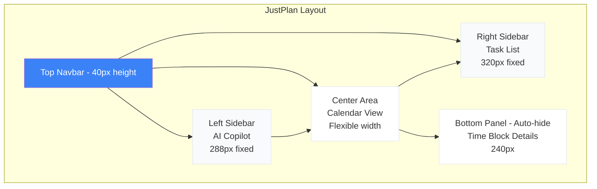

# JustPlan UI/UX Specification

> **Design Philosophy**: Clean, simple, and efficient. Minimize interaction steps and reduce cognitive load through an IDE-inspired layout that keeps all essential tools in view. JustPlan combines the speed of keyboard-driven interfaces with the clarity of visual design.

**Version**: 1.0  
**Last Updated**: February 19, 2026  
**Status**: Complete Specification

---

## Table of Contents

1. [Overview & Design Philosophy](#overview--design-philosophy)
2. [UX Research & User Personas](#ux-research--user-personas)
3. [Design System](#design-system)
4. [Layout Architecture](#layout-architecture)
5. [Component Specifications](#component-specifications)
6. [Interactions & Behaviors](#interactions--behaviors)
7. [Accessibility & Performance](#accessibility--performance)
8. [Implementation Notes](#implementation-notes)

---

## Overview & Design Philosophy

### Core Principles

1. **Reduce Friction**: Task creation in <30 seconds, calendar navigation in 1 click
2. **Visual Clarity**: Clear hierarchy, readable typography, sufficient contrast
3. **Power User Friendly**: Keyboard shortcuts, syntax input, customizable workflows
4. **Calm Productivity**: Soft backgrounds for focus, bright alerts only when urgent
5. **Flexible Customization**: Collapsible sidebars, custom workflows, theme options

### Design Goals

- **Speed**: Fast task entry via syntax parser, instant calendar updates
- **Scannable**: Calendar blocks show status at a glance (solid/dotted, color-coded)
- **Contextual**: Details appear only when needed (auto-hide bottom panel)
- **Intelligent**: AI copilot assists with scheduling, workflow management
- **Accessible**: WCAG 2.1 AA compliant, full keyboard navigation

---

## UX Research & User Personas

### User Archetypes

#### 1. **The Busy Professional** (Primary Persona)
- **Demographics**: 28-45 years, knowledge worker, 50+ tasks/week
- **Goals**: Maximize productive hours, minimize context switching, meet deadlines
- **Pain Points**: 
  - Too many tools (calendar, task manager, project tracker)
  - Manual scheduling is time-consuming
  - Hard to visualize workload
- **Behaviors**: 
  - Checks calendar 10+ times/day
  - Prefers keyboard shortcuts
  - Works in focused blocks (Pomodoro-style)
- **Design Implications**: 
  - Syntax input for fast task creation
  - Calendar-centric view
  - AI-suggested scheduling
  - Focus time configuration

#### 2. **The Student** (Secondary Persona)
- **Demographics**: 18-25 years, full-time student, 20-30 tasks/week
- **Goals**: Balance coursework, study time, social activities
- **Pain Points**:
  - Procrastination leads to deadline crunches
  - Difficulty estimating task duration
  - Inconsistent work schedule
- **Behaviors**:
  - Mobile-first usage
  - Visual learner (prefers color-coding)
  - Needs deadline reminders
- **Design Implications**:
  - Mobile-responsive layout
  - Workflow states with visual colors
  - Deadline proximity alerts
  - Student schedule template

#### 3. **The Project Manager** (Tertiary Persona)
- **Demographics**: 30-50 years, manages 3-5 projects, 100+ tasks/week
- **Goals**: Track team progress, identify bottlenecks, report status
- **Pain Points**:
  - Complex workflows (Scrum, Kanban, custom)
  - Task dependencies
  - Needs custom reporting
- **Behaviors**:
  - Customizes workflows heavily
  - Uses advanced features (subtasks, dependencies)
  - Exports data for reporting
- **Design Implications**:
  - Visual workflow editor
  - Workflow import/export
  - Template library
  - Advanced filtering

### User Journey Maps

#### Journey 1: Creating a Task (Fast Path)
1. **Trigger**: User remembers a task to do
2. **Action**: Press `Cmd+N` or click "Add New Task"
3. **Input**: Type `Write report [2hr:Focus time:before Feb 25]`
4. **Feedback**: Autocomplete shows syntax suggestions inline
5. **Confirmation**: Task appears in sidebar + calendar (AI-scheduled)
6. **Outcome**: Task created in <30 seconds

**Emotions**: Efficient → Confident → Satisfied

#### Journey 2: Rescheduling via AI Copilot
1. **Trigger**: User realizes they're overbooked tomorrow
2. **Action**: Open AI Copilot, type "Move low-priority tasks to next week"
3. **AI Response**: Shows affected tasks list (5 tasks)
4. **Review**: User reviews changes in calendar preview
5. **Confirmation**: User approves, calendar updates
6. **Outcome**: Calendar rebalanced in <10 seconds

**Emotions**: Stressed → Hopeful → Relieved → Confident

#### Journey 3: Customizing Workflow
1. **Trigger**: User wants to add "QA" state to workflow
2. **Action**: Avatar → Settings → Workflow Configuration
3. **Visual Editor**: Drags from "Review" node to create new "QA" state
4. **Configuration**: Sets color (teal), adds transition conditions
5. **Save**: Clicks "Save", workflow updates across app
6. **Outcome**: Custom workflow active in <2 minutes

**Emotions**: Curious → Engaged → Accomplished

### Pain Points Solved by JustPlan

| Traditional Calendar Apps | JustPlan Solution |
|---------------------------|-------------------|
| Manual task scheduling tedious | AI auto-scheduling based on priorities, deadlines |
| Context switching between calendar/tasks | Integrated calendar + task list + AI copilot in one view |
| Generic workflows (no customization) | Visual workflow editor with import/export |
| No task breakdown guidance | AI-powered task breakdown with duration estimates |
| Flat task lists (no hierarchy) | Parent tasks with subtasks, dependencies |
| Overwhelming calendar views | Subtasks <30min hidden, dotted vs solid differentiation |
| No keyboard-driven workflows | Syntax parser, keyboard shortcuts for all actions |

### Usability Metrics (Success Criteria)

- **Task Creation**: <30 seconds (syntax input)
- **Calendar Navigation**: 1-click to any view (day/week/month)
- **AI Copilot Response**: <2 seconds to start streaming
- **Workflow Export**: <5 seconds to download JSON
- **Settings Search**: <1 second to filter results
- **Calendar Render**: <1 second for 100 tasks
- **Sidebar Toggle**: Smooth 300ms animation

---

## Design System

### Color Palette

**Based on UI/UX Pro Max recommendation**: Productivity-focused (calm backgrounds + urgent alerts)

#### Primary Colors
```css
--color-primary: #3B82F6;        /* Blue - Primary actions, Ready state */
--color-primary-light: #60A5FA;  /* Light Blue - Hover states */
--color-primary-dark: #2563EB;   /* Dark Blue - Active states */

--color-cta: #F97316;            /* Orange - CTA buttons, In Progress state */
--color-cta-hover: #EA580C;      /* Orange Hover */
```

#### Workflow State Colors
```css
--color-backlog: #71717A;        /* Gray - Backlog state */
--color-ready: #3B82F6;          /* Blue - Ready state */
--color-in-progress: #F97316;    /* Orange - In Progress state */
--color-blocked: #EF4444;        /* Red - Blocked state */
--color-review: #A855F7;         /* Purple - Review state */
--color-done: #10B981;           /* Green - Done state */
```

#### Neutral Colors
```css
--color-background: #F8FAFC;     /* Light theme background */
--color-background-dark: #0F172A; /* Dark theme background */
--color-surface: #FFFFFF;        /* Cards, panels (light) */
--color-surface-dark: #1E293B;   /* Cards, panels (dark) */

--color-text-primary: #1E293B;   /* Primary text (light) */
--color-text-primary-dark: #F8FAFC; /* Primary text (dark) */
--color-text-secondary: #64748B; /* Secondary text */
--color-text-muted: #94A3B8;     /* Muted text */
```

#### Semantic Colors
```css
--color-success: #10B981;        /* Success messages, Done state */
--color-warning: #F59E0B;        /* Warning messages */
--color-error: #EF4444;          /* Error messages, Blocked state */
--color-info: #3B82F6;           /* Info messages */
```

#### Calendar-Specific Colors
```css
--color-scheduled-opacity: 1;    /* Solid background for scheduled tasks */
--color-suggested-opacity: 0.4;  /* Lighter opacity for AI-suggested */
--color-pinned-border: #1E293B;  /* Border for pinned tasks */
--color-external-stripe: repeating-linear-gradient(
  45deg,
  #E2E8F0,
  #E2E8F0 10px,
  #F8FAFC 10px,
  #F8FAFC 20px
); /* Striped pattern for external events */
```

### Typography

**Font Family**: Plus Jakarta Sans (Google Fonts)

```css
@import url('https://fonts.googleapis.com/css2?family=Plus+Jakarta+Sans:wght@300;400;500;600;700&display=swap');

--font-family: 'Plus Jakarta Sans', -apple-system, BlinkMacSystemFont, 'Segoe UI', sans-serif;
```

#### Type Scale
```css
--font-size-xs: 12px;            /* Labels, badges */
--font-size-sm: 14px;            /* Body text, task descriptions */
--font-size-base: 16px;          /* Default text */
--font-size-lg: 18px;            /* Subheadings */
--font-size-xl: 20px;            /* Section titles */
--font-size-2xl: 24px;           /* Page titles */
--font-size-3xl: 30px;           /* Hero text (landing) */

--font-weight-light: 300;        /* Subtle text */
--font-weight-normal: 400;       /* Body text */
--font-weight-medium: 500;       /* Emphasis */
--font-weight-semibold: 600;     /* Headings */
--font-weight-bold: 700;         /* Strong emphasis */

--line-height-tight: 1.25;       /* Headings */
--line-height-normal: 1.5;       /* Body text */
--line-height-relaxed: 1.75;     /* Long-form content */
```

### Spacing & Layout

```css
--spacing-xs: 4px;
--spacing-sm: 8px;
--spacing-md: 16px;
--spacing-lg: 24px;
--spacing-xl: 32px;
--spacing-2xl: 48px;
--spacing-3xl: 64px;

--border-radius-sm: 4px;         /* Badges, small buttons */
--border-radius-md: 8px;         /* Cards, inputs */
--border-radius-lg: 12px;        /* Panels, modals */
--border-radius-xl: 16px;        /* Hero sections */
--border-radius-full: 9999px;    /* Pills, avatars */
```

### Shadows & Elevation

**Flat Design Pattern**: Minimal shadows, rely on borders and backgrounds

```css
--shadow-sm: 0 1px 2px rgba(0, 0, 0, 0.05);      /* Subtle lift */
--shadow-md: 0 4px 6px rgba(0, 0, 0, 0.1);       /* Cards */
--shadow-lg: 0 10px 15px rgba(0, 0, 0, 0.1);     /* Modals */
--shadow-focus: 0 0 0 2px var(--color-primary);  /* Focus rings */
```

### Z-Index Scale

```css
--z-base: 0;                     /* Default layer */
--z-dropdown: 10;                /* Dropdown menus */
--z-bottom-panel: 20;            /* Auto-hide bottom panel */
--z-sidebar: 30;                 /* Left/right sidebars */
--z-modal: 40;                   /* Modals, dialogs */
--z-navbar: 50;                  /* Top navbar (always on top) */
--z-popover: 60;                 /* Popovers, tooltips */
--z-toast: 70;                   /* Toast notifications */
```

### Animation Timing

```css
--duration-instant: 100ms;       /* Hover states */
--duration-fast: 150ms;          /* Quick transitions */
--duration-normal: 200ms;        /* Standard transitions */
--duration-slow: 300ms;          /* Settings sections, modals */
--duration-panel: 250ms;         /* Bottom panel slide */

--easing-default: ease-in-out;   /* General purpose */
--easing-out: ease-out;          /* Exit animations */
--easing-in: ease-in;            /* Enter animations */
```

### Accessibility

- **Contrast Ratios**: Minimum 4.5:1 for normal text, 3:1 for large text (WCAG 2.1 AA)
- **Focus Indicators**: 2px solid ring with primary color
- **Touch Targets**: Minimum 44x44px for all interactive elements
- **Motion**: Respect `prefers-reduced-motion` media query

---

## Layout Architecture

### Three-Column Layout with Bottom Panel



### Panel Specifications

| Panel | Size | Collapsible |
|-------|------|-------------|
| Navbar | 40px height | No |
| Left AI Sidebar | 288px (w-72) | Yes (toggle button) |
| Center Calendar | Flexible | No |
| Right Task Sidebar | 320px (w-80) | Yes (toggle button) |
| Bottom Panel | 240px | Yes (slide down) |

### Responsive Breakpoints

```css
/* Mobile: Bottom tab navigation, full-screen panels */
@media (max-width: 767px) {
  /* Stack panels vertically, bottom nav bar */
}

/* Tablet: Icon-only sidebars, expand on click */
@media (min-width: 768px) and (max-width: 1023px) {
  /* Collapse sidebars to 60px icon-only mode */
}

/* Desktop: Full layout with collapsible sidebars */
@media (min-width: 1024px) {
  /* Standard three-column layout */
}

/* Large Desktop: Same layout, more space for calendar */
@media (min-width: 1440px) {
  /* More horizontal space for calendar view */
}
```

---

## Component Specifications

### 1. Top Navbar

**Height**: 40px (ultra-thin)  
**Layout**: Three sections (left, center, right)

#### Left Section: Current Task Button
```tsx
// Visual Design
┌─────────────────────────────────┐
│ ● Write report          [23:45] │ ← Green dot (in progress)
└─────────────────────────────────┘
```

- **Elements**:
  - Status indicator dot (3 colors):
    - Green (#10B981): Task in progress
    - Orange (#F97316): Task due soon
    - Gray (#94A3B8): No active task
  - Task title (truncated to 20 chars)
  - Elapsed timer (MM:SS format)
- **Interactions**:
  - Click: Jump to task in calendar or open in bottom panel
  - Hover: Show full task title tooltip
- **States**: Active, Idle (no task), Hidden (user preference)

#### Center Section: Global Search
```tsx
// Visual Design
┌──────────────────────────────────────────┐
│ 🔍 Search tasks, events, conversations... │
└──────────────────────────────────────────┘
```

- **Width**: 40% of navbar, max 600px
- **Placeholder**: "Search tasks, events, conversations..."
- **Keyboard Shortcut**: `Cmd+K` or `Ctrl+K`
- **Search Behavior**:
  - Live results dropdown (appears below input)
  - Debounced (300ms)
  - Categories: Tasks (icon 📋), Events (icon 🗓️), Past Conversations (icon 💬)
  - Each result shows: Icon, Title, Date/Time, Badge (workflow state or priority)
- **Results Dropdown**:
  - Max 10 results
  - Arrow keys to navigate
  - Enter to select
  - Escape to close
  - "View all results" link at bottom

#### Right Section: Avatar + Dropdown
```tsx
// Visual Design
┌──────────────┐
│ 👤 John Doe ▼│
└──────────────┘
```

- **Elements**:
  - Avatar image (32px circle) or initials
  - Name (truncated to 15 chars on small screens)
  - Dropdown arrow icon
- **Dropdown Menu**:
  ```
  ┌────────────────────────────────┐
  │ John Doe                       │
  │ john@example.com               │
  ├────────────────────────────────┤
  │ ⚙️  Settings                   │
  │ ⌨️  Keyboard Shortcuts         │
  ├────────────────────────────────┤
  │ ☀️ Theme: Light ▼              │ ← Inline toggle
  ├────────────────────────────────┤
  │ 🚪 Logout                      │
  └────────────────────────────────┘
  ```
- **Theme Toggle Options**: Light, Dark, System (auto)

---

### 2. Left Sidebar: AI Copilot

**Purpose**: Conversational AI assistant with tool access to manage tasks, find calendar slots, modify workflows

#### Layout
```tsx
┌─────────────────────────────┐
│  AI Copilot          [ ≡ ]  │ ← Header with collapse button
├─────────────────────────────┤
│                             │
│  ┌──────────────────────┐   │
│  │ AI: How can I help?  │   │ ← Assistant message
│  └──────────────────────┘   │
│                             │
│  ┌──────────────────────┐   │
│  │ Find me 30 minutes   │   │ ← User message
│  │ tomorrow morning     │   │
│  └──────────────────────┘   │
│                             │
│  ┌──────────────────────┐   │
│  │ 🗓️ Checking calendar │   │ ← Tool execution indicator
│  │ Found 3 slots:       │   │
│  │ • 9:00-9:30 AM       │   │
│  │ • 10:30-11:00 AM     │   │
│  │ • 2:00-2:30 PM       │   │
│  │ [Schedule at 9 AM]   │   │ ← Quick action button
│  └──────────────────────┘   │
│                             │
├─────────────────────────────┤
│ Ask AI...            [↑]   │ ← Input field + send button
└─────────────────────────────┘
```

#### Example Use Cases (with visual indicators)

1. **Task Creation**:
   ```
   User: "Create a task: Finish report [2hr:Focus time:before Feb 25]"
   AI: ✏️ Creating task...
       ✓ Task "Finish report" created and scheduled for Feb 23, 9:00-11:00 AM
   ```

2. **Calendar Search**:
   ```
   User: "Find me 30 minutes for a meeting tomorrow morning"
   AI: 🗓️ Checking calendar...
       Found 3 available slots:
       • 9:00-9:30 AM  [Schedule Meeting]
       • 10:30-11:00 AM  [Schedule Meeting]
       • 2:00-2:30 PM  [Schedule Meeting]
   ```

3. **Workflow Modification**:
   ```
   User: "Update workflow: add 'QA' state after 'Review'"
   AI: ⚙️ Modifying workflow...
       Added "QA" state with:
       • Color: Teal (#14B8A6)
       • Position: Between Review → Done
       • Auto-transition: If code review approved
       [View Workflow Editor]
   ```

4. **Bulk Operations**:
   ```
   User: "Move all 'Blocked' tasks to next week"
   AI: 🔄 Updating tasks...
       Moved 5 tasks:
       • Fix API bug → Feb 26, 9:00 AM
       • Update docs → Feb 27, 2:00 PM
       • Code review → Feb 28, 10:00 AM
       • Deploy staging → March 1, 3:00 PM
       • QA testing → March 2, 9:00 AM
       [Undo] [View Calendar]
   ```

5. **Workflow Import/Export**:
   ```
   User: "Export my workflow as JSON"
   AI: 📦 Exporting workflow...
       ✓ Downloaded: justplan-workflow-2026-02-19.json
       [Import Different Workflow]
   ```

#### Tool Access Indicators

| Icon | Tool | Description |
|------|------|-------------|
| 🗓️ | Calendar | Checking availability, finding slots |
| ✏️ | Task CRUD | Creating, updating, deleting tasks |
| ⚙️ | Workflow | Modifying workflow states, transitions |
| 🔄 | Bulk Operations | Moving, rescheduling multiple tasks |
| 📦 | Import/Export | Workflow JSON operations |
| 🔍 | Search | Finding tasks, events |

#### Collapsed State (Icon-Only Mode)

When collapsed (60px width):
```tsx
┌────┐
│ 🤖 │ ← AI icon only
│    │
│    │
│    │
│    │
└────┘
```

Click icon to expand temporarily (overlay panel) or permanently (restore width)

---

### 3. Center Area: Calendar View

**Purpose**: Primary workspace showing time-blocked schedule

#### Week View (Default)

```tsx
┌─────────────────────────────────────────────────────────────┐
│  February 17-23, 2026         [Day] [Week] [Month]   [+]    │ ← Header
├──────┬────────────────────────────────────────────────────