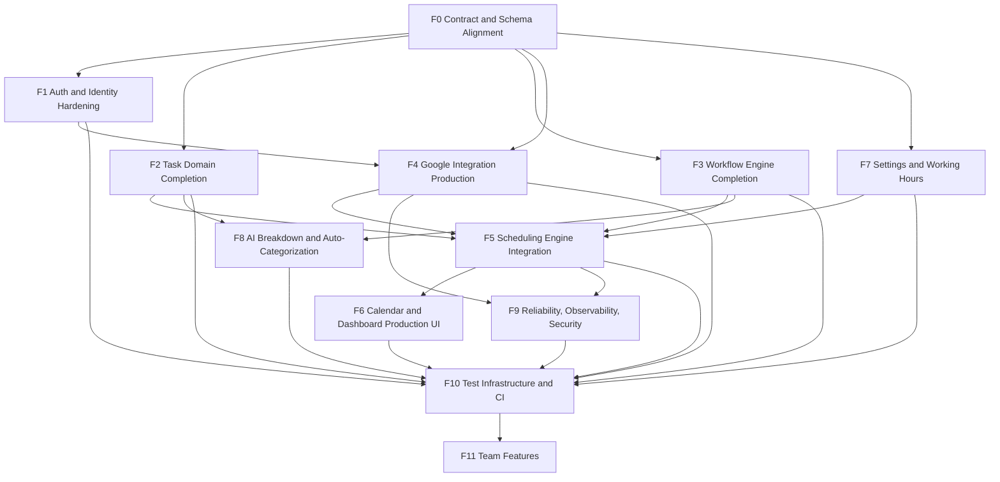
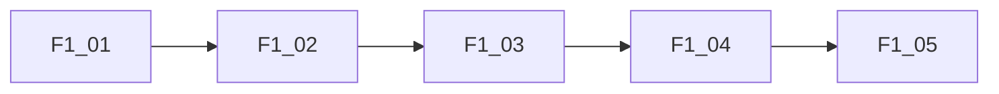
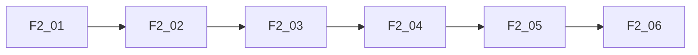
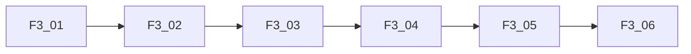
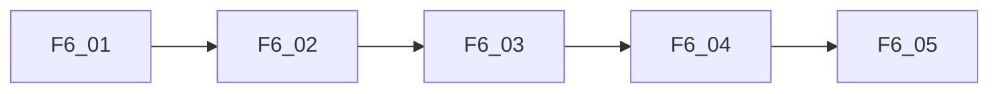
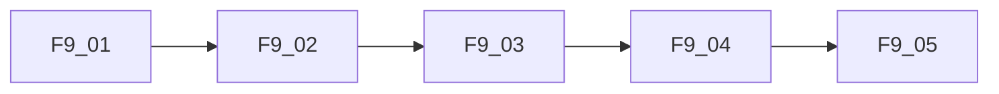
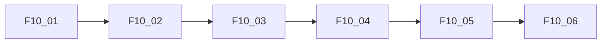
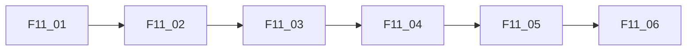

# JustPlan Full-Version TASK Backlog

## Scope and Sources
This backlog is the execution plan for the full version (Phase 0-5 scope), not MVP only.

Source documents:
- `docs/02-development-plan.md`
- `docs/05-test-plan.md`
- Current implementation across `src/`, `src/app/api/`, `src/components/`, `src/services/`, `src/workers/`, `supabase/migrations/`

Current backlog policy:
- Remaining work only (completed work is excluded).
- Every subtask must be independently deliverable.
- Size limit per subtask: <= 1 engineer day and <= 400 LOC.

Subtask format:
- `[ ] <ID> <Title>; Depends on: <IDs>; Estimate: <time>; Change Budget: <LOC>; Description: <scope>`

---

## Global Feature Dependency Graph

---

## F0. Contract and Schema Alignment
Feature objective: align DB schema, generated types, service contracts, API payloads, and hooks.

- [ ] `F0-01` Design Doc: domain/DB/API contract matrix; Depends on: none; Estimate: 0.5d; Change Budget: <=200 LOC; Description: create mismatch inventory for tasks/workflows/scheduling/google/auth payloads and canonical camelCase API contract.
- [ ] `F0-02` Migration Pack: schema reconciliation; Depends on: F0-01; Estimate: 1d; Change Budget: <=300 LOC; Description: add missing columns used by code (Google token storage and workflow/scheduling compatibility fields) or remove stale references with migration-safe plan.
- [ ] `F0-03` Type Sync: regenerate/update `src/types/database.types.ts`; Depends on: F0-02; Estimate: 0.5d; Change Budget: <=250 LOC; Description: ensure TS types are migration-accurate and remove implicit `any` casts caused by schema drift.
- [ ] `F0-04` Service Adapter Normalization; Depends on: F0-03; Estimate: 1d; Change Budget: <=350 LOC; Description: map DB snake_case <-> domain camelCase inside services only; enforce one translation boundary.
- [ ] `F0-05` API Payload Normalization; Depends on: F0-04; Estimate: 1d; Change Budget: <=350 LOC; Description: normalize route handler request/response contracts and backward compatibility guards for currently mismatched keys.
- [ ] `F0-06` Contract Integration Tests; Depends on: F0-05; Estimate: 1d; Change Budget: <=350 LOC; Description: add integration tests validating canonical request/response and schema parity for tasks/workflows/scheduling routes.

---

## F1. Auth and Identity Hardening
Feature objective: remove all mock identity paths and enforce real authenticated boundaries in API and workers.

- [ ] `F1-01` Design Doc: auth model for API + worker contexts; Depends on: F0-05; Estimate: 0.5d; Change Budget: <=180 LOC; Description: define user identity extraction, service-role usage rules, and audit expectations.
- [ ] `F1-02` API Auth Enforcement; Depends on: F1-01; Estimate: 1d; Change Budget: <=300 LOC; Description: remove `MOCK_USER_ID` fallback in protected routes and return 401/403 with consistent error schema.
- [ ] `F1-03` OAuth State Integrity for Google flow; Depends on: F1-02; Estimate: 0.5d; Change Budget: <=220 LOC; Description: sign/validate state payload and bind callback user to current session.
- [ ] `F1-04` Worker Authorization Boundary; Depends on: F1-02; Estimate: 1d; Change Budget: <=350 LOC; Description: ensure queue jobs cannot operate across tenants and only use explicit user-scoped queries.
- [ ] `F1-05` Auth Integration Tests; Depends on: F1-04; Estimate: 1d; Change Budget: <=320 LOC; Description: add unauthorized, cross-tenant, and protected-route tests.

---

## F2. Task Domain Completion
Feature objective: production-grade task CRUD with subtasks, dependencies, and real UI wiring.

- [ ] `F2-01` Design Doc: task lifecycle and dependency semantics; Depends on: F0-06; Estimate: 0.5d; Change Budget: <=200 LOC; Description: define parent/subtask completion logic, override rules, and dependency blocking behavior.
- [ ] `F2-02` Backend: service parity fixes; Depends on: F2-01; Estimate: 1d; Change Budget: <=380 LOC; Description: align create/update/get/delete task service with canonical fields, subtask nesting, and soft delete consistency.
- [ ] `F2-03` Backend: dependency constraint checks; Depends on: F2-02; Estimate: 1d; Change Budget: <=320 LOC; Description: prevent scheduling/completion when dependency chain is unresolved; add clear failure reasons.
- [ ] `F2-04` Frontend: remove task mocks in sidebar and bottom panel; Depends on: F2-02; Estimate: 1d; Change Budget: <=350 LOC; Description: wire `TaskSidebar` and `BottomPanel` to hooks/API, including real create/edit/delete/subtask operations.
- [ ] `F2-05` Unit Tests: task service and parser contract; Depends on: F2-03; Estimate: 1d; Change Budget: <=320 LOC; Description: add tests for subtask nesting, deletion behavior, dependency rules, and parser-to-create flow.
- [ ] `F2-06` Integration Tests: task API routes; Depends on: F2-04, F2-05; Estimate: 1d; Change Budget: <=350 LOC; Description: verify end-to-end task lifecycle through API handlers.

---

## F3. Workflow Engine Completion
Feature objective: complete custom states, transitions, history tracking, and execution engine.

- [ ] `F3-01` Design Doc: transition DSL and execution rules; Depends on: F0-06; Estimate: 0.5d; Change Budget: <=220 LOC; Description: formalize condition types, precedence, idempotency, and failure rollback policy.
- [ ] `F3-02` Backend: workflow state payload alignment; Depends on: F3-01; Estimate: 1d; Change Budget: <=320 LOC; Description: align workflow state fields between API, service, DB, and graph payload (remove stale names).
- [ ] `F3-03` Backend: transition payload alignment and reorder endpoint; Depends on: F3-02; Estimate: 1d; Change Budget: <=380 LOC; Description: add `PUT /api/workflows/reorder` and normalize transitions CRUD input shape.
- [ ] `F3-04` Worker: implement `workflow-transitions.worker.ts`; Depends on: F3-03; Estimate: 1d; Change Budget: <=350 LOC; Description: background evaluator for automatic transitions using enabled rules.
- [ ] `F3-05` Frontend: workflow editor save/apply stability; Depends on: F3-03; Estimate: 1d; Change Budget: <=350 LOC; Description: make graph editing resilient for create/update/delete cycles and preserve node-edge consistency.
- [ ] `F3-06` Tests: unit + integration for transitions/history; Depends on: F3-04, F3-05; Estimate: 1d; Change Budget: <=360 LOC; Description: validate condition evaluation, execution, and `task_state_history` writes.

---

## F4. Google Integration Production
Feature objective: reliable two-way sync with secure token lifecycle and conflict handling.

- [ ] `F4-01` Design Doc: token lifecycle and sync ownership; Depends on: F1-03, F0-06; Estimate: 0.5d; Change Budget: <=220 LOC; Description: define source-of-truth rules, conflict strategy, and refresh token behavior.
- [ ] `F4-02` Backend: token storage and retrieval hardening; Depends on: F4-01; Estimate: 1d; Change Budget: <=300 LOC; Description: align user token columns or secure storage table usage and remove brittle `any` access patterns.
- [ ] `F4-03` Backend: calendar read/write sync correctness; Depends on: F4-02; Estimate: 1d; Change Budget: <=400 LOC; Description: complete create/update/delete parity and metadata mapping between tasks and events.
- [ ] `F4-04` Backend: Google Tasks two-way sync completion; Depends on: F4-02; Estimate: 1d; Change Budget: <=380 LOC; Description: complete import/export/update completion flow with conflict resolution.
- [ ] `F4-05` Frontend: integrations status and manual sync UX; Depends on: F4-03, F4-04; Estimate: 1d; Change Budget: <=300 LOC; Description: show connection state, recent sync result, and actionable errors.
- [ ] `F4-06` Tests: integration with Google client mocks; Depends on: F4-05; Estimate: 1d; Change Budget: <=360 LOC; Description: add rate-limit/retry/auth-failure tests for Google routes/services.

---

## F5. Scheduling Engine Integration
Feature objective: production scheduling pipeline across service, worker, constraints, and persistence.

- [ ] `F5-01` Design Doc: constraint matrix and trigger model; Depends on: F2-06, F3-06, F4-06, F7-04; Estimate: 0.5d; Change Budget: <=220 LOC; Description: define pinned/deadline/split/buffer/focus constraints and incremental reschedule triggers.
- [ ] `F5-02` Backend: scheduling worker field alignment; Depends on: F5-01; Estimate: 1d; Change Budget: <=380 LOC; Description: fix mismatched DB field names in worker/service (`scheduled_start`, duration fields, state flags).
- [ ] `F5-03` Backend: queue dedupe and job lifecycle controls; Depends on: F5-02; Estimate: 1d; Change Budget: <=320 LOC; Description: enforce one active job/user and robust cancel/retry semantics.
- [ ] `F5-04` Backend: reschedule triggers from task/workflow/settings changes; Depends on: F5-03; Estimate: 1d; Change Budget: <=350 LOC; Description: auto-enqueue on relevant mutation events with debouncing.
- [ ] `F5-05` Frontend: scheduling status UX and warnings; Depends on: F5-03; Estimate: 1d; Change Budget: <=300 LOC; Description: expose active job progress, warnings, and retry controls.
- [ ] `F5-06` Tests: unit + integration scheduling correctness/perf; Depends on: F5-04, F5-05; Estimate: 1d; Change Budget: <=380 LOC; Description: verify constraint handling and runtime budgets for 100-task scenarios.

---

## F6. Calendar and Dashboard Production UI
Feature objective: replace placeholder calendar/dashboard behavior with full production flows.

- [ ] `F6-01` Design Doc: production calendar interactions from `docs/06-ui.md`; Depends on: F5-05; Estimate: 0.5d; Change Budget: <=220 LOC; Description: specify drag/drop, resize, state colors, suggested vs scheduled styles, and panel behaviors.
- [ ] `F6-02` Frontend: calendar data wiring (remove mock blocks); Depends on: F6-01; Estimate: 1d; Change Budget: <=380 LOC; Description: fetch real events/tasks and render by view/day/week/month.
- [ ] `F6-03` Frontend: manual drag-drop and pin/unpin interactions; Depends on: F6-02; Estimate: 1d; Change Budget: <=350 LOC; Description: connect interactions to scheduling/task update APIs.
- [ ] `F6-04` Frontend: bottom panel detail editing and AI actions wiring; Depends on: F6-02; Estimate: 1d; Change Budget: <=320 LOC; Description: integrate real task details, subtask toggles, and action buttons.
- [ ] `F6-05` Tests: component + integration + focused E2E for dashboard; Depends on: F6-03, F6-04; Estimate: 1d; Change Budget: <=380 LOC; Description: cover create/select/edit/schedule/move/complete user flow.

---

## F7. Settings and Working Hours
Feature objective: fully functional settings and working-hours configuration driving scheduler behavior.

- [ ] `F7-01` Design Doc: settings IA and persistence model; Depends on: F0-06; Estimate: 0.5d; Change Budget: <=200 LOC; Description: define sections, route layout, and source of truth for preferences.
- [ ] `F7-02` Backend: working hours/settings API endpoints; Depends on: F7-01; Estimate: 1d; Change Budget: <=360 LOC; Description: add CRUD for daily hours, timezone, break time, focus windows, and validation.
- [ ] `F7-03` Frontend: replace "Coming Soon" settings sections; Depends on: F7-02; Estimate: 1d; Change Budget: <=380 LOC; Description: implement forms for workflow shortcut links, integrations status, working-hours editor.
- [ ] `F7-04` Backend/Frontend: schedule preference propagation; Depends on: F7-03; Estimate: 1d; Change Budget: <=300 LOC; Description: ensure settings updates immediately influence scheduling inputs.
- [ ] `F7-05` Tests: unit + integration for settings/working-hours; Depends on: F7-04; Estimate: 1d; Change Budget: <=320 LOC; Description: validate timezone conversion and daily constraints.

---

## F8. AI Breakdown and Auto-Categorization
Feature objective: production AI task breakdown plus full auto-categorization engine with confidence controls.

- [ ] `F8-01` Design Doc: AI boundaries, confidence policy, and fallback; Depends on: F2-06, F3-06; Estimate: 0.5d; Change Budget: <=220 LOC; Description: define accept/review/reject thresholds and explicit-rule precedence.
- [ ] `F8-02` Backend: breakdown quota and cache layer; Depends on: F8-01; Estimate: 1d; Change Budget: <=350 LOC; Description: implement per-user limits and cache keys for repeated requests.
- [ ] `F8-03` Backend: auto-categorization service + schema; Depends on: F8-01; Estimate: 1d; Change Budget: <=400 LOC; Description: implement state suggestion pipeline and history logging.
- [ ] `F8-04` Backend: batch recategorization job; Depends on: F8-03; Estimate: 1d; Change Budget: <=350 LOC; Description: daily job for active tasks and override tracking.
- [ ] `F8-05` Frontend: suggestion review UI for medium confidence; Depends on: F8-03; Estimate: 1d; Change Budget: <=320 LOC; Description: present reasoning, alternatives, accept/reject actions.
- [ ] `F8-06` Tests: AI schema/unit/integration coverage; Depends on: F8-04, F8-05; Estimate: 1d; Change Budget: <=380 LOC; Description: validate parser, structured output, confidence handling, and quota enforcement.

---

## F9. Reliability, Observability, Security
Feature objective: resilient operations with measurable behavior and security guardrails.

- [ ] `F9-01` Design Doc: error taxonomy and telemetry model; Depends on: F4-06, F5-06; Estimate: 0.5d; Change Budget: <=220 LOC; Description: define structured error codes and user-facing message map.
- [ ] `F9-02` Backend: structured logging and correlation IDs; Depends on: F9-01; Estimate: 1d; Change Budget: <=320 LOC; Description: instrument API and worker flows with request/job trace IDs.
- [ ] `F9-03` Backend: retry/backoff/circuit patterns for external dependencies; Depends on: F9-02; Estimate: 1d; Change Budget: <=360 LOC; Description: standardize resilience wrappers for Google and queue operations.
- [ ] `F9-04` Security: RLS and secret handling audit fixes; Depends on: F9-02; Estimate: 1d; Change Budget: <=300 LOC; Description: remove unsafe patterns, verify tenant isolation at query boundaries.
- [ ] `F9-05` Tests: fault-injection integration tests; Depends on: F9-03, F9-04; Estimate: 1d; Change Budget: <=350 LOC; Description: simulate Google failure, token expiry, worker retries, and degraded-mode behavior.

---

## F10. Test Infrastructure and CI
Feature objective: implement planned test pyramid and pnpm-only CI execution.

- [x] `F10-01` Design Doc: executable test strategy from `docs/05-test-plan.md`; Depends on: F1-05, F2-06, F3-06, F4-06, F5-06, F6-05, F7-05, F8-06, F9-05; Estimate: 0.5d; Change Budget: <=220 LOC; Description: map required suites to actual files and owners.
- [x] `F10-02` Infra: add `vitest.integration.config.ts` and test env bootstrap; Depends on: F10-01; Estimate: 1d; Change Budget: <=280 LOC; Description: create integration config expected by scripts and stable setup fixtures.
- [x] `F10-03` Tests: add missing integration suites for services/routes; Depends on: F10-02; Estimate: 1d; Change Budget: <=400 LOC; Description: prioritize task/workflow/scheduling/google APIs.
- [x] `F10-04` Tests: add Playwright critical path E2E suites; Depends on: F10-02; Estimate: 1d; Change Budget: <=400 LOC; Description: auth, task lifecycle, scheduling, workflow transitions, Google sync happy path.
- [x] `F10-05` CI: migrate workflows to pnpm-only commands; Depends on: F10-03; Estimate: 1d; Change Budget: <=260 LOC; Description: replace npm/npx in GitHub workflows with pnpm equivalents and caches.
- [ ] `F10-06` CI: quality gates and reporting; Depends on: F10-04, F10-05; Estimate: 1d; Change Budget: <=280 LOC; Description: enforce lint/type/unit/integration/build and optional E2E gate policy.

---

## F11. Team Features (Phase 5)
Feature objective: multi-user collaboration foundations (workspace, roles, shared tasks/calendars).

- [ ] `F11-01` Design Doc: workspace and role model; Depends on: F10-06; Estimate: 0.5d; Change Budget: <=220 LOC; Description: define team ownership model, role permissions, and migration strategy from personal mode.
- [ ] `F11-02` Backend: DB migrations for workspace/membership entities; Depends on: F11-01; Estimate: 1d; Change Budget: <=360 LOC; Description: create tables, indexes, RLS policies for team isolation and role checks.
- [ ] `F11-03` Backend: team-aware task/workflow/scheduling APIs; Depends on: F11-02; Estimate: 1d; Change Budget: <=400 LOC; Description: add workspace scoping, assignment, and shared visibility rules.
- [ ] `F11-04` Frontend: workspace switch and assignment UI; Depends on: F11-03; Estimate: 1d; Change Budget: <=380 LOC; Description: implement workspace selector and team-aware task/calendar filters.
- [ ] `F11-05` Frontend/Backend: collaboration basics; Depends on: F11-03; Estimate: 1d; Change Budget: <=380 LOC; Description: task comments/activity feed scaffold with permission checks.
- [ ] `F11-06` Tests: integration + E2E for team permissions and sharing; Depends on: F11-04, F11-05; Estimate: 1d; Change Budget: <=400 LOC; Description: validate owner/admin/member behavior and shared task/calendar flows.

---

## Execution Milestones

- Milestone A (Core Contract and Identity): F0 + F1 complete.
- Milestone B (Single-User Production Core): F2 + F3 + F4 + F7 complete.
- Milestone C (Scheduling and Production UX): F5 + F6 complete.
- Milestone D (AI + Reliability + Quality): F8 + F9 + F10 complete.
- Milestone E (Team Features): F11 complete.

---

## Release Readiness Checklist

- [ ] No `MOCK_USER_ID` in protected APIs.
- [ ] DB schema/types/services/routes are contract-aligned.
- [ ] Full scheduling loop works with Google integration and workflow transitions.
- [ ] Placeholder UI sections replaced with production flows.
- [ ] Unit/integration/E2E suites implemented per test plan.
- [ ] CI uses pnpm only and enforces required quality gates.
- [ ] Team workspace features pass permission and sharing tests.
